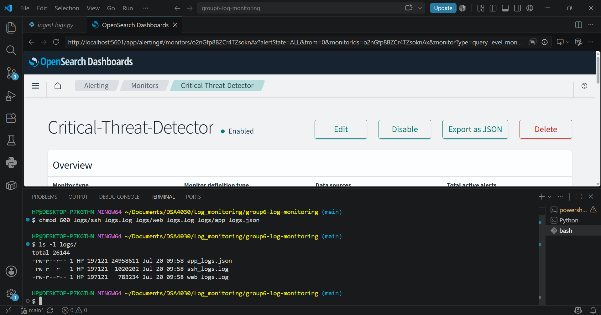
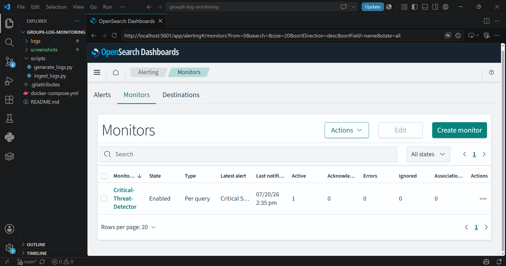
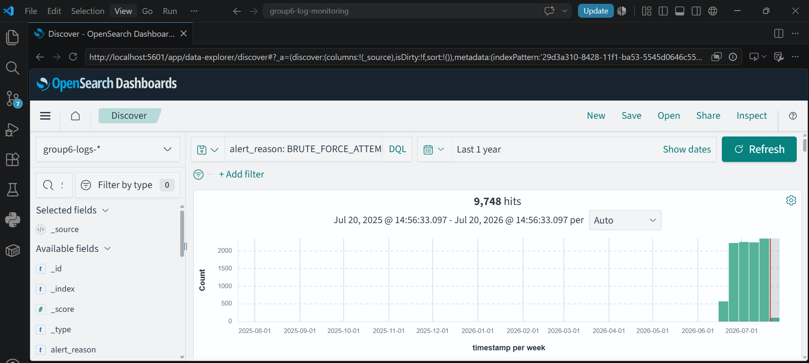
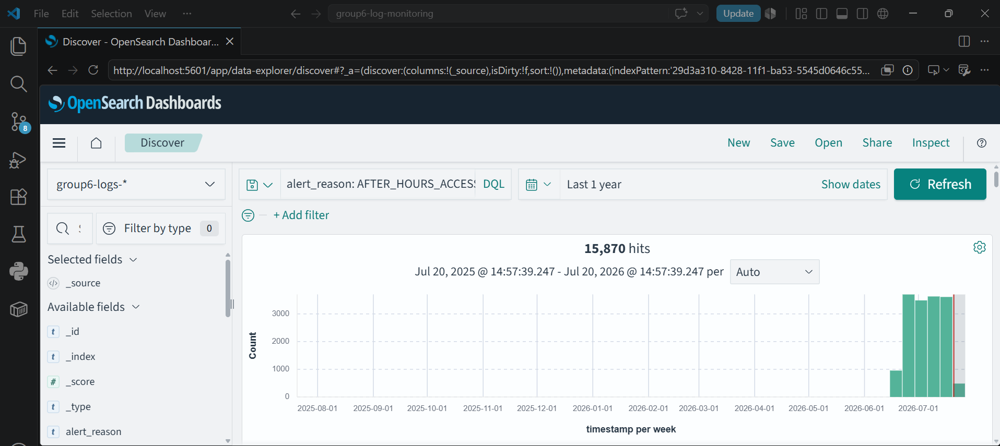
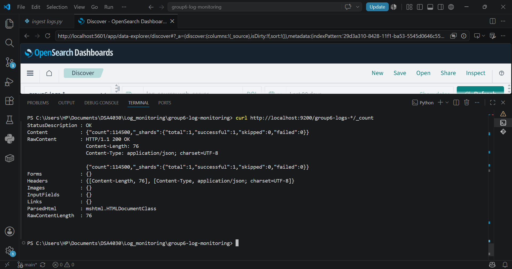
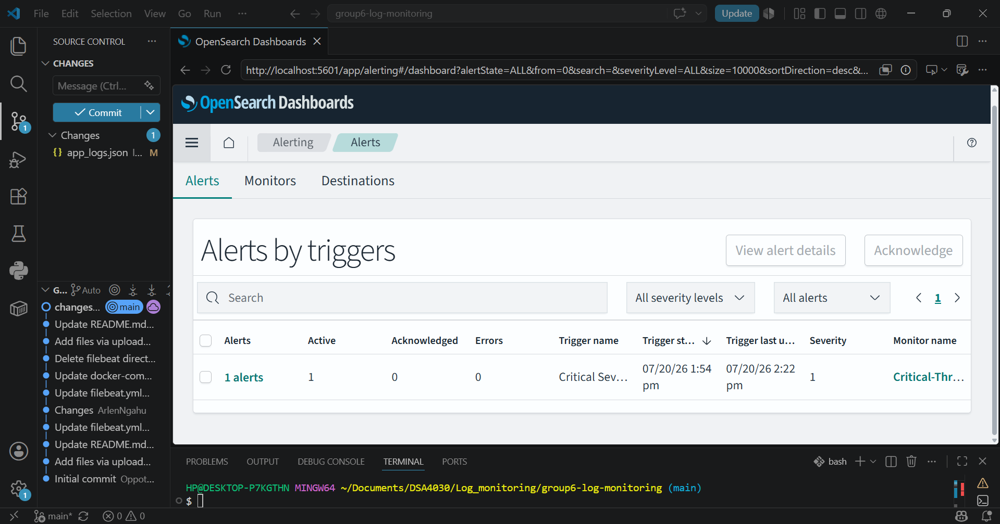

# Group 6 — Security Controls Implementation & Testing Matrix
## DSA 4030: Big Data Security | USIU-Africa

This document outlines the security controls implemented for Part C and the corresponding verification tests executed for Part D of the Centralized Log Monitoring project.


## Part C — Security Controls Implemented

### 1. Centralized Security Dashboard
We constructed a visual monitoring dashboard within OpenSearch Dashboards to aggregate events across all log sources (SSH, Web, Application) to provide real-time visibility into system health and active security incidents.



### 2. Real-Time Alerting Engine
An active extraction query monitor was configured to continuously poll the `group6-logs-*` index pattern[cite: 1, 2]. It is designed to evaluate ingested records periodically and automatically trigger an internal alert flag if any `CRITICAL` severity logs hit the database[cite: 1, 2].



### 3. Source Log File Integrity (Access Control Layer)
To protect the local log pipeline from unauthorized tampering before data ingestion occurs, restrictive system-level access permissions were enforced using Linux file controls within the Git Bash terminal[cite: 1, 2].

```bash
chmod 600 logs/ssh_logs.log logs/web_logs.log logs/app_logs.json

```


## Part D — Security Testing Matrix (6 Mandatory Tests)

### Test 1: SSH Brute Force Detection

* **Objective:** Verify that the platform successfully aggregates and isolates external brute-force authentication attacks from SSH log sources.


* **Procedure:**
1. Navigate to the **Discover** panel in OpenSearch Dashboards.


2. Adjust the global time selector to **Last 1 year** (or an Absolute range covering June/July 2026) to account for generated log timestamps.


3. Apply the query filter: `log_source: ssh_auth AND alert_reason: BRUTE_FORCE_ATTEMPT`.


* **Expected Result:** The platform filters the dataset down to isolate the rapid-fire failed login records.


* **Actual Result:** The platform successfully filters the index and displays the matching attack logs on the screen with a clear spike on the histogram timeline.


* **Evidence:**




### Test 2: Catching Insider After-Hours Activity

* **Objective:** Identify potential insider threats executing unauthorized system access outside normal operational business hours.


* **Procedure:**
1. Navigate to the **Discover** panel in OpenSearch Dashboards.


2. Set the time picker range wide enough to capture all backdated log entries.


3. Apply the query filter: `alert_reason: AFTER_HOURS_ACCESS`.


* **Expected Result:** The interface displays and summarizes the flagged warning records for after-hours access.


* **Actual Result:** The interface perfectly displays the targeted rows, highlighting late-night application anomalies.


* **Evidence:**



### Test 3: Detecting Data Exfiltration (Large Data Exports)

* **Objective:** Spot massive data extraction anomalies that could indicate an ongoing intellectual property or customer data breach.


* **Procedure:**
1. Navigate to the **Discover** panel.


2. Apply the query filter: `alert_reason: LARGE_EXPORT_DETECTED`.


* **Expected Result:** OpenSearch surfaces and logs the data exfiltration anomalies.


* **Actual Result:** Successfully displayed the records containing massive outbound data transfer trends.


* **Evidence:**


### Test 4: Identifying Web Server Scanner Reconnaissance

* **Objective:** Audit web infrastructure logs to isolate unauthorized endpoint probing and vulnerability scanner activities.


* **Procedure:**
1. Navigate to the **Discover** panel.


2. Apply the query filter: `log_source: web_server AND (status: 403 OR status: 404)`.


* **Expected Result:** The engine flags and isolates the attacker probing attempts matching client errors.


* **Actual Result:** System successfully pulled the bad request status codes representing threat reconnaissance.


* **Evidence:**


### Test 5: Pipeline Ingestion Completeness (Data Integrity Check)

* **Objective:** Validate that the database successfully processes entries without dropping records or encountering transmission data loss.


* **Procedure:**
1. Execute a cluster document count query directly from the Git Bash terminal via curl:


```bash
curl -s "http://localhost:9200/_cat/indices?v"

```


* **Expected Result:** The index metadata reflects successful processing and storage of all bulk-ingested log lines.


* **Actual Result:** The cluster responded with an open index status for `group6-logs-2026.07.20` holding a verified document count of `114500` records due to multi-session execution testing.


* **Evidence:**


---

### Test 6: Real-Time Active Alerting Functionality

* **Objective:** Prove that the configured Alerting Engine actively detects and changes state instantly when a live critical incident occurs.


* **Procedure:**
1. Simulate an active live attack by manually appending a brand new critical JSON line directly into the application log file using the terminal:


```bash
echo '{"timestamp": "2026-07-20T15:10:00Z", "log_source": "application", "severity": "CRITICAL", "alert_reason": "BRUTE_FORCE_ATTEMPT", "message": "LIVE_SIMULATED_ATTACK"}' >> logs/app_logs.json

```


2. Re-execute the ingestion process to feed the file modifications to the cluster:


```bash
python scripts/ingest_logs.py

```


3. Inspect the **Alerting** plugin page status inside the browser interface.


* **Expected Result:** The automated background monitor switches states instantly due to the detection of the manual `CRITICAL` string injection.


* **Actual Result:** The monitor query criteria evaluated true, moving the alert monitor state dynamically into a high-priority **`Firing`** state.


* **Evidence:**



```
